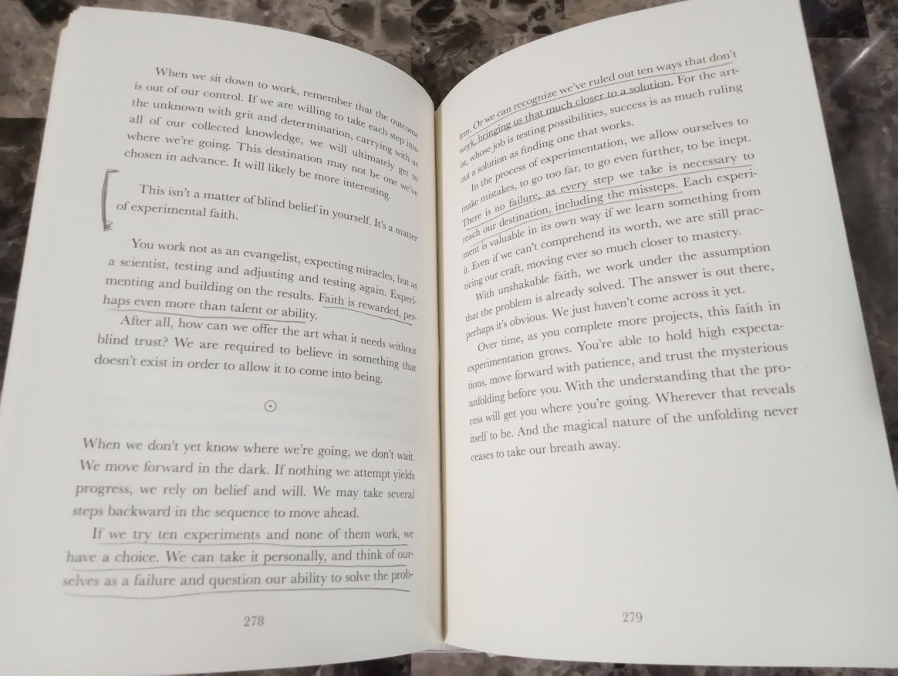

# AI Bookmarks

This project shows how to use multi-modal AI models from the GitHub Models catalog to extract marked passages from images.

Check out the accompanying blog post, [*Digitize Analog Bookmarks using AI, .NET, and GitHub Models*](https://www.lqdev.me/posts/digitize-analog-bookmarks-with-ai-dotnet)



## Quick Start

[](https://codespaces.new/lqdev/AIBookmarks)

When the Codespace starts:

1. Open the *.devcontainer.json* file.
1. Replace the value of `GITHUB_TOKEN` with your GitHub Personal Access Token. 

## Prerequisites

- [.NET 9 SDK](https://dotnet.microsoft.com/download/dotnet/9.0)
- GitHub Personal Access Token. For more details, see the [GitHub documentation](https://docs.github.com/en/authentication/keeping-your-account-and-data-secure/managing-your-personal-access-tokens).

## Setup

### Local 

Create an environment variable called `GITHUB_TOKEN` and set the value equal to your GitHub Personal Access Token. 

## Run application

Open the terminal and enter the following command.

```bash
dotnet run
```

This will process all images in the *data* directory and print a list of passages to the console. If successful, the output should look similar to the following:

```text
> This isn’t a matter of blind belief in yourself. It’s a matter of experimental faith. (pg. 278)

> When we don’t yet know where we’re going, we don’t wait. We move forward in the dark. If nothing we attempt yields progress, we rely on belief and will. We may take several steps backward in the sequence to move ahead. (pg. 278)

> If we try ten experiments and none of them work; we have a choice. We can take it personally, and think of ourselves as a failure and question our ability to solve the problem. (pg. 278)

> Staying in it means a commitment to remain open to what’s around you. Paying attention and listening. Looking for connections and relationships in the outside world. Searching for beauty. Seeking stories. Noticing what you find interesting, what makes you lean forward. And knowing all of this is available to use next time you sit down to work, where the raw data gets put into form. (pg. 296)

> Just as a surfer can’t control the waves, artists are at the mercy of the creative rhythms of nature. This is why it’s of such great importance to remain aware and present at all times. Watching and waiting. (pg. 296)

> Maybe the best idea is the one you’re going to come up with this evening. (pg. 297)
```

## Extend the solution

Replace the files in the *data* with images of your own marked books. 

**NOTE: If you process a large number of images, you'll be limited by the GitHub Models rate limit policy. For more details, see the [GitHub Models documentation](https://docs.github.com/en/github-models/prototyping-with-ai-models#rate-limits).**
